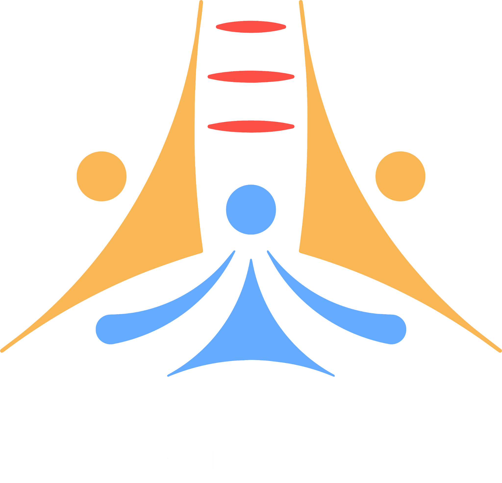
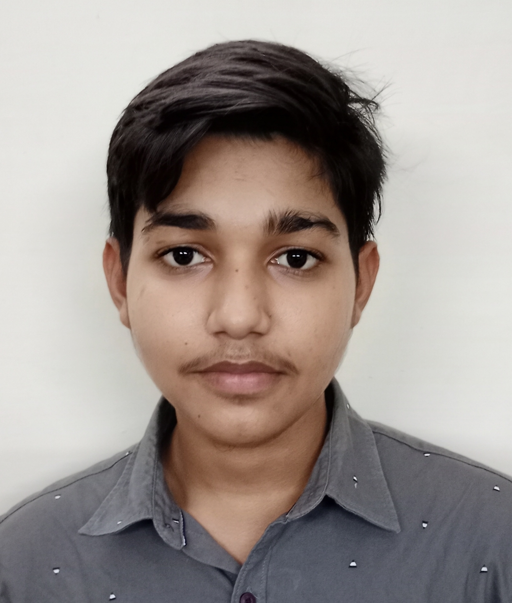
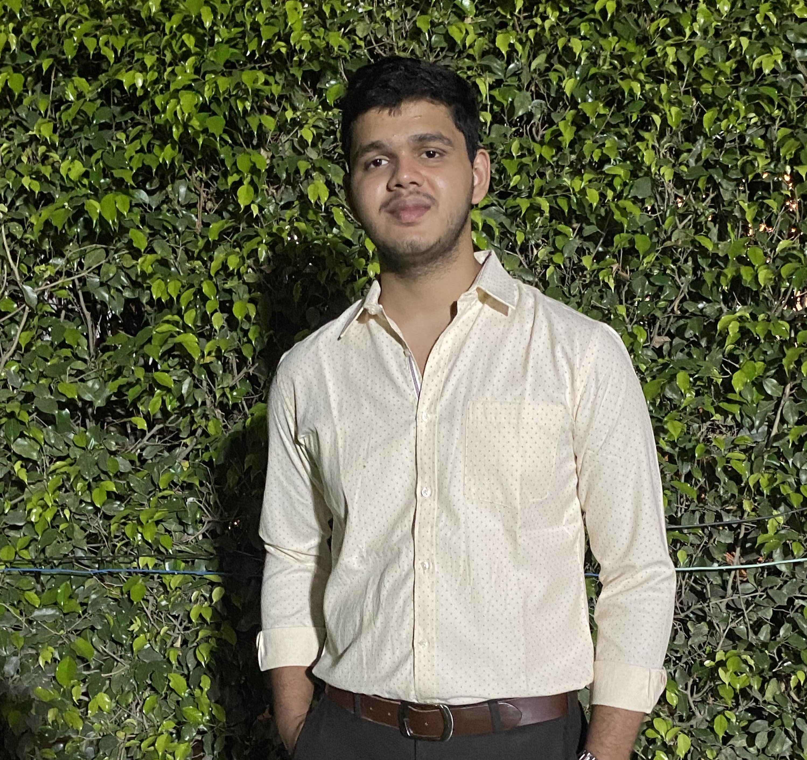
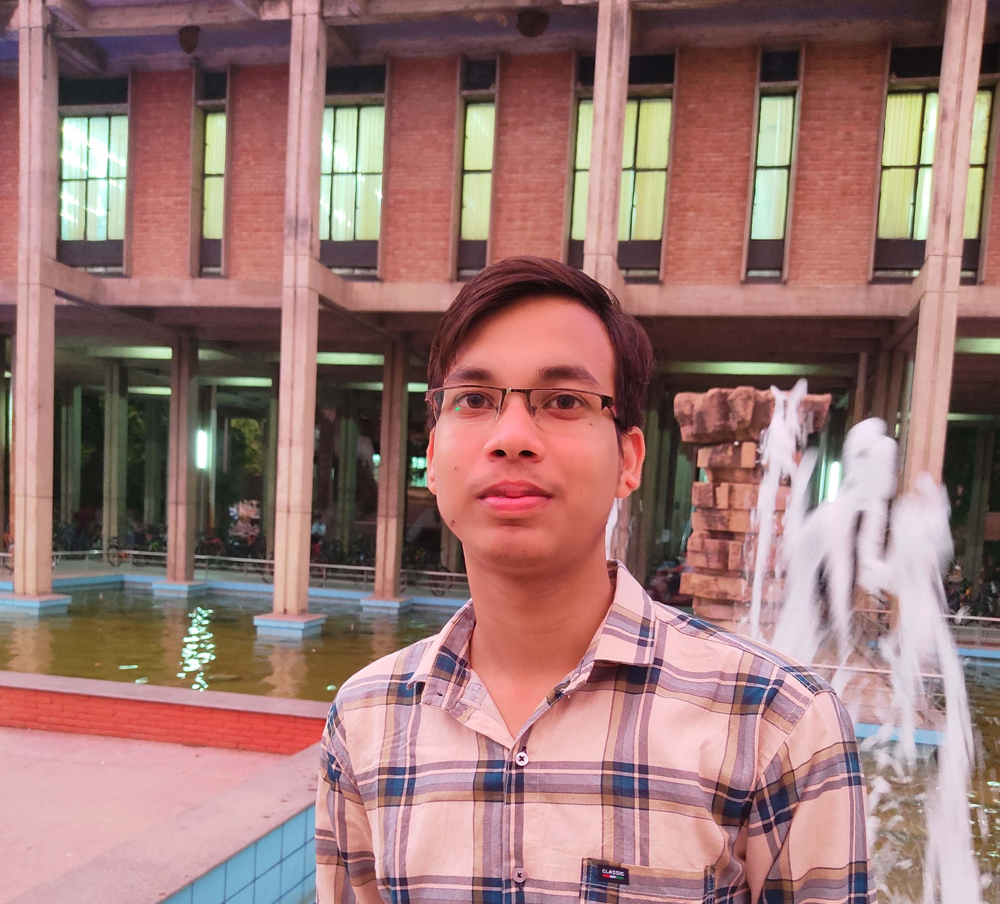

# SoCE-IITK 2021
<code></code>
## SoCE IITK 2021 website @ [soce-iitk.herokuapp.com](https://soce-iitk.herokuapp.com/) 🎉🎉

## Website Developed By 💻

| Photo | Name | Email |
|---|---|---|
| <code> | [**Aman Kumar Singh**](https://github.com/amanks-20) | amanks20@iitk.ac.in |
| <code> | [**Faiza Khan**](https://github.com/faizak31) | faizakhan20@iitk.ac.in |
| <code> | [**Kumar Abhishek**](https://github.com/kabhishek20) | kabhishek20@iitk.ac.in |
| <code> | [**Saurabh Sahay**](https://github.com/sahay-saurabh) | ssahay20@iitk.ac.in |
| <code> | [**Shubham Kumar**](https://github.com/Shubham-707) | shubhamku20@iitk.ac.in |
| <code> | [**Yuvraj Singh**](https://github.com/Yuvraj1171) | syuvraj20@iitk.ac.in |

## Repository Tree 📄
 * ├─── [database](database/)   
   * ├─── [achievement.js ](database/achievement.js)
   * ├─── [alumni.js](database/alumni.js)
   * ├─── [coordi.js](database/coordi.js)
   * ├─── [data.js](database/data.js)
   * ├─── [faculty.js](database/faculty.js)
   * ├─── [placement.js](database/placement.js)
   * ├─── [secretary.js](database/secretary.js)
   * ├─── [team20](database/team20)
   * └─── [web.js](database/web.js)
* ├─── [public](public)
   * ├─── [css](public/css/)
   * ├─── [fontawesome-free-5.15.4-web](public/fontawesome-free-5.15.4-web/)
   * ├─── [fonts](public/fonts/)
   * ├─── [img](public/img/)
   * │  ├───Activities
   * │  │   ├───alumtalk
   * │  │   ├───fun-events
   * │  │   ├───get-together
   * │  │   └───strengths
   * │  ├───blogs
   * │  │   ├───Ashutosh-Ranjan
   * │  │   ├───Chitwan-Garg
   * │  │   ├───Dishaa-Rajora
   * │  │   ├───Dishant-Parewa
   * │  │   ├───Gourav-Kamboj
   * │  │   ├───Jeetendra-Kumar
   * │  │   ├───Krishan-Kumar
   * │  │   ├───Krishna-Deo
   * │  │   ├───Mudit-Kumar
   * │  │   ├───Rahul-Gauriyar
   * │  │   ├───Rajat-Ghoshal
   * │  │   ├───Samyak-Jain
   * │  │   ├───Shashi-Shekhar
   * │  │   ├───Shuaib-Alam
   * │  │   ├───Vineet-Shukla
   * │  │   └───Vishal-Agarwal
   * │  ├───Department
   * │  │   ├───alumni
   * │  │   ├───faculty
   * │  │   └───research
   * │  ├───Home
   * │  │   ├───highlights
   * │  │   └───recent
   * │  ├───Student-section
   * │  │   ├───branchmates
   * │  │   ├───placement
   * │  │   │   └───thumbnail
   * │  │   └───resume
   * │  └───team
   * └─── [js](public/js/)
     * ├─── [aos.js](public/js/aos.js)
     * ├─── [script.js](public/js/scriot.js)
     * └─── [slider.js](public/js/slider.js)
 * ├─── [views](views/)
   * ├─── [activities](views/activities/)
   * │ ├─── [alumniTalks.ejs](views/activities/alumniTalks.ejs)
   * │ ├─── [departmental.ejs](views/activities/departmental.ejs)
   * │ ├─── [fun_events.ejs](views/activities/fun_events.ejs)
   * │ └─── [strength.ejs](views/activities/strength.ejs)
   * ├─── [blogs](views/blogs/)
   * ├─── [department](views/department/)
   * │ ├─── [achievements.ejs](views/activities/achievements.ejs)
   * │ ├─── [faculty.ejs](views/activities/faculty.ejs)
   * │ ├─── [famous-alumni.ejs](views/activities/famous-alumni.ejs)
   * │ └─── [research.ejs](views/activities/research.ejs)
   * ├─── [partials](views/partials/)
   * │ ├─── [footer.ejs](views/activities/footer.ejs)
   * │ └─── [header.ejs](views/activities/header.ejs)   
   * └─── [student-section](views/student-section/)
   * │ ├─── [branchmates.ejs](views/activities/branchmates.ejs)
   * │ ├─── [civil-courses.ejs](views/activities/civil-courses.ejs)
   * │ ├─── [placement.ejs](views/activities/placement.ejs)
   * │ └─── [resumes.ejs](views/activities/resumes.ejs)
   * ├─── [about.ejs](views/activities/about.ejs)
   * ├─── [activities.ejs](views/activities/activities.ejs)
   * ├─── [department.ejs](views/activities/department.ejs)
   * ├─── [index.ejs](views/activities/index.ejs)
   * ├─── [post.ejs](views/activities/post.ejs)
   * ├─── [student-section.ejs](views/acREADMEtivities/student-section.ejs)
   * ├─── [teams.ejs](views/activities/teams.ejs)
   * └─── [teams20.ejs](views/activities/teams20.ejs)
 * ├─── [LICENSE](LICENSE)
 * ├─── [README](README.md)
 * └─── [sitemap.xml](sitemap.xml)

#### Canva Site Layouts 📝 (Courtesy Shubham)

- [SoCE Website](https://www.canva.com/design/DAEsiQTOrrM/Tq0m9SvyOg_elmVW0HdLgA/view?website#2:title-page)
- [About-Us](https://www.canva.com/design/DAEuaxDQGYc/XGKazHkNxQipher1FWnJDQ/view?website#2)
- [Activities](https://www.canva.com/design/DAEsivoIJ5Y/MLQnIQQE1s7_kb_s_vXRPg/view?website#2:activities)
- [Department](https://www.canva.com/design/DAEuYPG-TmA/X53Ir4oGb76Tg8_xrosrhg/view?website#2)
- [Student](https://www.canva.com/design/DAEuYHUTsPM/kaX1nOe1rP7Kr3-03QEFqg/view?website#2)

#### Copyrights 2021, SoCE IITK
